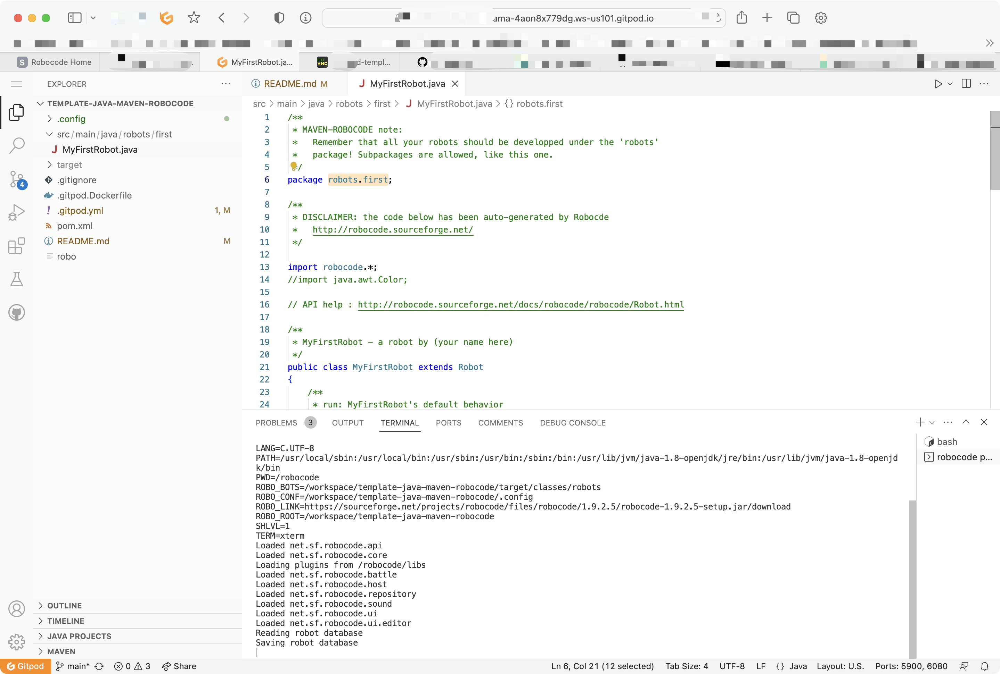
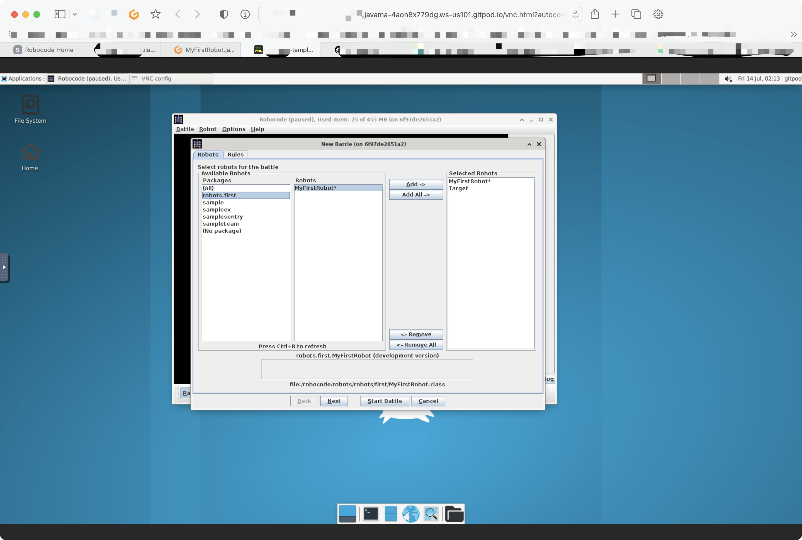
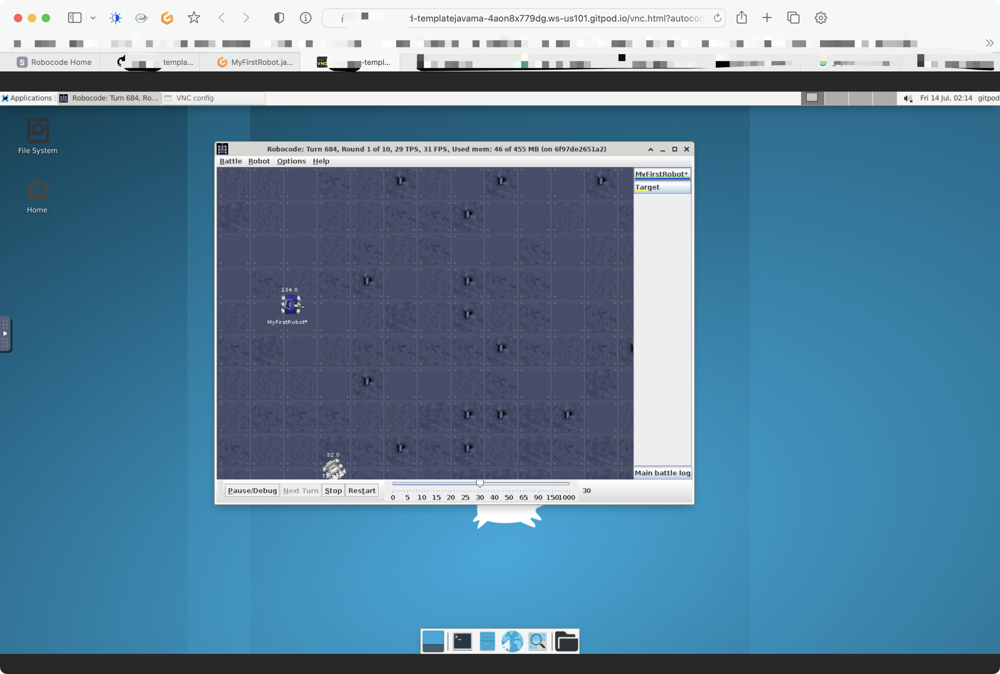

# template-java-maven-robocode

This project is inspired by the project of [fernandrone/robocode-maven](https://github.com/fernandrone/robocode-maven.git) and includes references to some of their code.

## Usage

1. Open this repository with Gitpod.
2. Wait for Gitpod to finish initializing and for the project initialization script to complete. If prompted to `install` the vscode extension, click the "install" button to install it.
3. Write your robot in the `robots.first` package (located in /src/main/java/).
4. Run the command `bash robo` in the terminal to start Robocode.
5. Open a new tab or browser and navigate to the remote desktop on port `6080`. You will see the interface of Robocode. Add your robot that you have written in the `robots.first` package. Select opponents for your robot, click "Start", and you can begin your performance.

## Screenshots

Code your robot.

Create new game.

Battle with others
